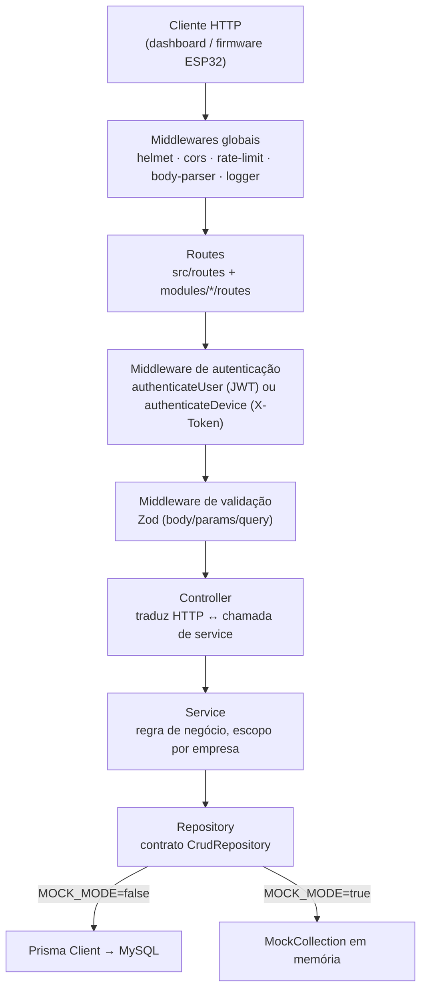
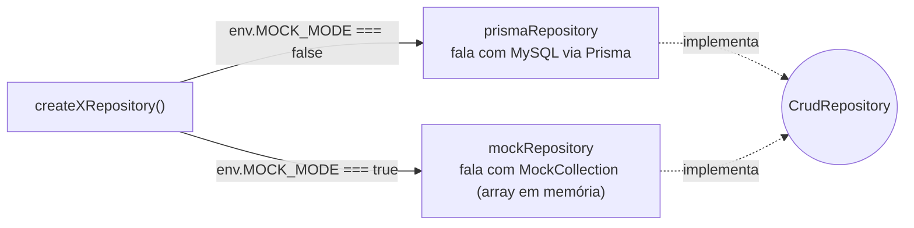
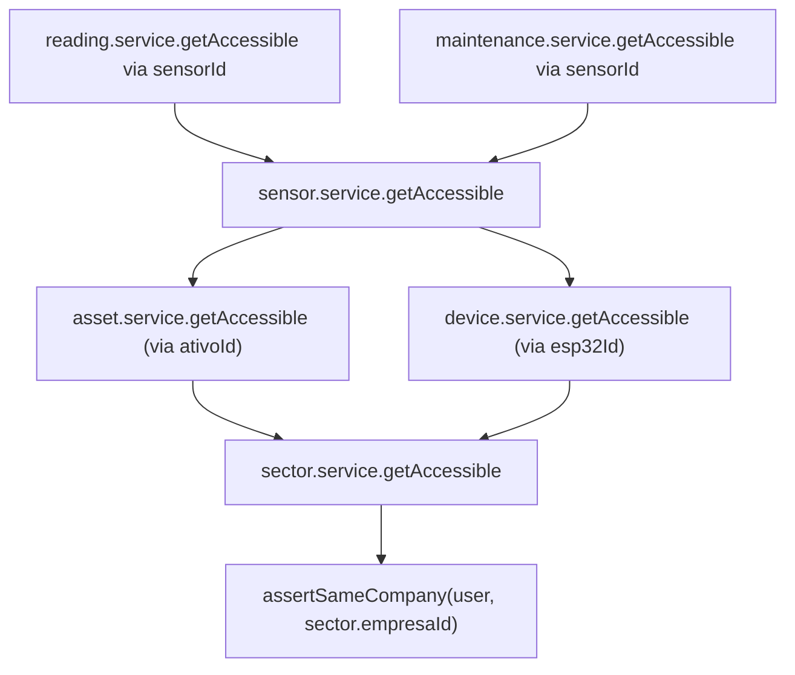
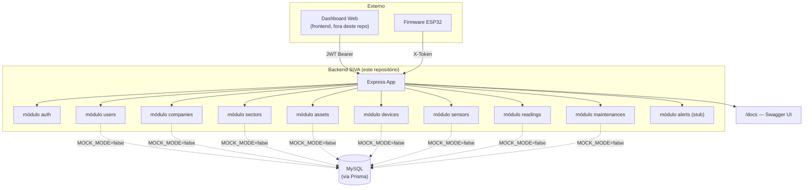

# Arquitetura

## Visão geral

O backend é um monólito modular em Node.js/TypeScript, organizado por **feature (feature-modular)** e em **camadas**, com a camada de persistência isolada atrás de uma interface (`CrudRepository`) — o suficiente de "arquitetura hexagonal" para trocar Prisma/MySQL por uma implementação em memória sem tocar em rota, controller ou service. Não há microsserviços, filas ou múltiplos processos nesta etapa: é um único processo Express.



## As camadas, em detalhe

| Camada | Responsabilidade | Não deve conter |
| --- | --- | --- |
| **Routes** (`*.routes.ts`) | Compor `Router()`: qual middleware roda em qual verbo/path | Regra de negócio, acesso a dado |
| **Middlewares** (`src/middlewares`) | Preocupações transversais: autenticação, validação de payload, log de requisição, tradução de exceção → resposta HTTP | Regra de negócio específica de um recurso |
| **Controllers** (`*.controller.ts`) | Ler `req`, chamar o service certo, formatar a resposta (`ok`/`created`/`paginated`/`noContent`) | Lógica de autorização além de repassar `req.user`/`req.device`, acesso direto a repository |
| **Services** (`*.service.ts`) | Regra de negócio: checar propriedade/escopo (`assertSameCompany`), orquestrar múltiplos repositories, decidir o que é erro de negócio | Detalhe de SQL/Prisma, formatação de resposta HTTP |
| **Repositories** (`*.repository.ts`) | Implementar `CrudRepository<Entity, CreateDTO, UpdateDTO>` duas vezes — uma para Prisma, uma para o mock — e expor um factory `create<X>Repository()` que escolhe pela flag `MOCK_MODE` | Regra de negócio, validação de entrada |
| **Entities** (`*.entity.ts`) | O formato de domínio do recurso (o que a API expõe), independente do formato de linha do banco | — |
| **DTOs** (`*.dtos.ts`) | Tipos TypeScript inferidos dos schemas Zod (`z.infer`) — o "contrato" de entrada de cada operação | — |
| **Validators** (`*.validators.ts`) | Os schemas Zod em si (create/update/params/query) | — |

O contrato `CrudRepository<TEntity, TCreateInput, TUpdateInput>` está em [`src/interfaces/repository.interface.ts`](../src/interfaces/repository.interface.ts):

```ts
interface CrudRepository<TEntity, TCreateInput, TUpdateInput> {
  list(options?: ListOptions): Promise<ListResult<TEntity>>;
  findById(id: number | string): Promise<TEntity | null>;
  create(data: TCreateInput): Promise<TEntity>;
  update(id: number | string, data: TUpdateInput): Promise<TEntity | null>;
  remove(id: number | string): Promise<boolean>;
}
```

## O "modo mock" como parte da arquitetura, não um hack à parte

Cada repository tem duas implementações reais do mesmo contrato:



Isso significa: **é a mesma arquitetura**, não uma versão "de brincadeira" da API. Todo o resto do sistema (controllers, services, middlewares de auth/validação) não sabe e não precisa saber qual das duas está ativa. É isso que permite ao time de frontend consumir a API inteira (`npm run dev:mock`) sem MySQL, com dados de exemplo realistas — ver [`src/shared/mock/mock-store.ts`](../src/shared/mock/mock-store.ts) para o seed e [ADR 0005](./adr/0005-mock-mode-api-fake.md) para o porquê dessa escolha.

## Estrutura de pastas

```
src/
├── app.ts                  # monta o Express app: middlewares globais + rotas + error handler
├── server.ts                # sobe o HTTP server, trata SIGINT/SIGTERM (graceful shutdown)
│
├── config/
│   └── env.ts                # lê e valida process.env com Zod; falha rápido se algo obrigatório faltar
│
├── database/
│   └── prisma.ts              # instancia o PrismaClient (singleton); no-op se MOCK_MODE=true
│
├── docs/
│   ├── openapi.ts             # documento OpenAPI 3.0 escrito à mão (fonte de verdade da doc da API)
│   └── docs.routes.ts         # serve o Swagger UI e o /docs/openapi.json em runtime
│
├── middlewares/
│   ├── auth.middleware.ts      # authenticateUser (JWT), authorize(...roles), authenticateDevice (X-Token)
│   ├── validate.middleware.ts  # aplica um schema Zod em body/params/query
│   ├── error-handler.middleware.ts  # converte AppError/ZodError/erro genérico em resposta HTTP padronizada
│   ├── not-found.middleware.ts  # 404 padrão para rota inexistente
│   └── request-logger.middleware.ts  # log estruturado por requisição (Pino), com request id
│
├── routes/
│   └── index.ts               # agrega as rotas de todos os módulos sob /api, expõe /api/health
│
├── modules/                    # um módulo por recurso de domínio — ver seção seguinte
│   ├── auth/  users/  companies/  sectors/  assets/
│   └── devices/  sensors/  readings/  maintenances/  alerts/
│
├── shared/
│   ├── errors/app-error.ts     # AppError e as subclasses (NotFoundError, ForbiddenError, ...)
│   ├── http/                    # api-response.ts (ok/created/paginated/noContent), pagination.ts
│   ├── auth/scope.ts            # assertSameCompany/isSuperAdmin — a regra de multi-tenant
│   └── mock/                    # MockCollection, createMockRepository, mock-store (seed)
│
├── types/
│   └── express.d.ts             # augmenta Request com user/device/log
│
├── utils/
│   ├── logger.ts, async-handler.ts, bigint-json.ts
│
├── interfaces/
│   └── repository.interface.ts  # o contrato CrudRepository citado acima
│
└── jobs/                        # reservado para tarefas agendadas — nenhuma implementada nesta etapa
```

### O que tem dentro de cada `modules/<recurso>/`

```
modules/sectors/
├── controllers/sector.controller.ts
├── services/sector.service.ts
├── repositories/sector.repository.ts
├── routes/sector.routes.ts
├── entities/sector.entity.ts
├── dtos/sector.dtos.ts
└── validators/sector.validators.ts
```

| Módulo | Tabela/conceito | Observação |
| --- | --- | --- |
| `auth` | — | Login (JWT) e `/me`; não tem entidade própria, reusa o repository de `users` |
| `users` | `usuario` | CRUD de usuários do dashboard (super_admin/admin_empresa/funcionario) |
| `companies` | `empresa` | Tenant raiz da hierarquia |
| `sectors` | `setor` | Pertence a uma empresa |
| `assets` | `ativo` | Equipamento monitorado (tanque, bomba...), pertence a um setor |
| `devices` | `esp32` | Central de comunicação física, pertence a um setor, autentica via `X-Token` |
| `sensors` | `sensor` | Vincula um `ativo` a um `esp32` |
| `readings` | `leitura` | Histórico de vazão; ingestão via `X-Token`, leitura via JWT |
| `maintenances` | `manutencao` | Chamados de manutenção por sensor |
| `alerts` | — | 🚧 Rota e estrutura existem; a regra de detecção de vazamento **não está implementada** (ver [BUSINESS_FLOWS.md](./BUSINESS_FLOWS.md)) |

Ver o modelo de dados completo em [DATABASE.md](./DATABASE.md).

## Multi-tenant: como o isolamento entre empresas é aplicado

A hierarquia é `Empresa → Setor → (Ativo | ESP32) → Sensor → (Leitura | Manutenção)`. Cada nível "sobe" a verificação de acesso para o nível pai, formando uma cadeia:



`assertSameCompany` (em [`src/shared/auth/scope.ts`](../src/shared/auth/scope.ts)) deixa passar sempre que `user.tipo === 'super_admin'`; para os demais, exige `user.empresaId === recurso.empresaId`, lançando `ForbiddenError` (403) caso contrário. Ver limitação conhecida desse desenho em [SECURITY.md](./SECURITY.md#isolamento-entre-tenants).

## Trade-off consciente: acoplamento entre módulos

Diferente de uma hexagonal "de livro", os services de módulos diferentes **se importam diretamente** (`sensor.service` importa `asset.service` e `device.service`; `reading.service` e `maintenance.service` importam `sensor.service`) em vez de passar por uma porta/interface compartilhada. Foi uma escolha deliberada para esta etapa: o domínio tem uma hierarquia rígida e pequena (5 níveis), e formalizar uma porta para cada relação teria custo de abstração sem benefício real ainda. A troca de implementação de banco (Prisma ↔ mock) é o único eixo em que o desacoplamento via interface (`CrudRepository`) realmente importa hoje, e é onde ele foi aplicado.

## Diagrama de componentes (nível C4 — Container/Component)


