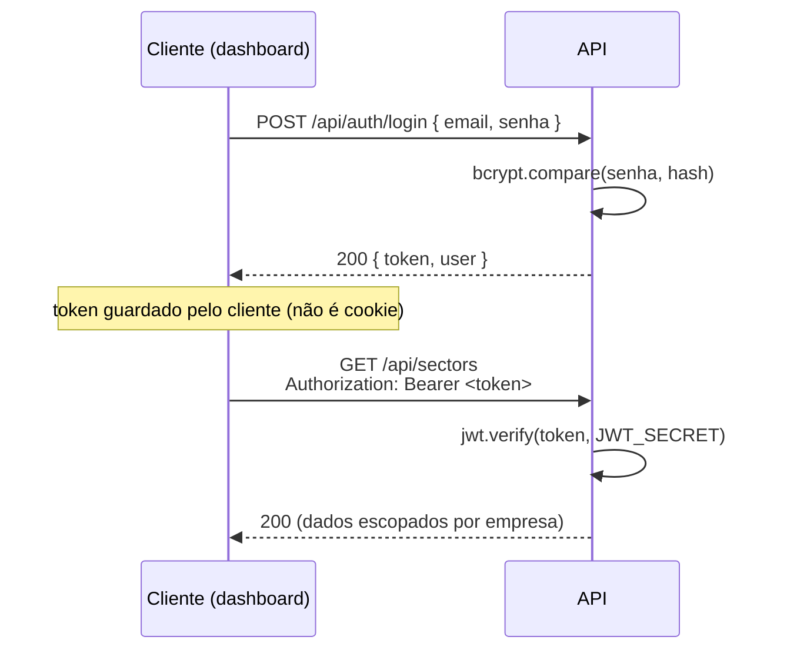
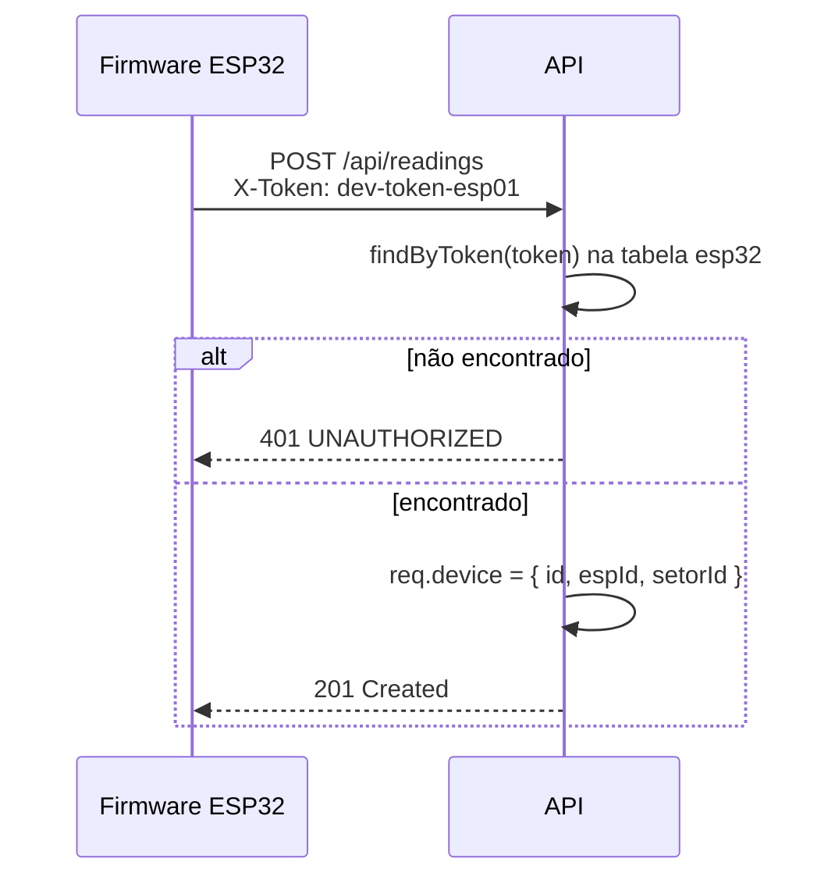

# Autenticação e Autorização

O sistema tem **dois mecanismos de autenticação independentes**, para dois tipos de cliente completamente diferentes:

| | Usuário do dashboard | Dispositivo ESP32 |
| --- | --- | --- |
| Credencial | e-mail + senha → JWT | `token` fixo gerado no cadastro |
| Header | `Authorization: Bearer <jwt>` | `X-Token: <token>` |
| Middleware | [`authenticateUser`](../src/middlewares/auth.middleware.ts) | [`authenticateDevice`](../src/middlewares/auth.middleware.ts) |
| Usado em | quase todas as rotas de `/api` | só `POST /api/readings` |
| Identifica | uma pessoa, com papel (`tipo`) e empresa | um ESP32 específico, com setor |

Os dois nunca se misturam na mesma rota — ver a lista completa em [API.md](./API.md#catálogo-de-endpoints).

## Autenticação de usuário (JWT)



- O token é assinado com `HS256` (padrão da lib `jsonwebtoken`), segredo em `JWT_SECRET`, validade em `JWT_EXPIRES_IN` (default `8h`).
- **Payload do JWT** (visível — JWT não é criptografado, só assinado; nunca coloque dado sensível aqui):
  ```json
  { "id": 2, "email": "carla.mendes@aquaplas.com", "tipo": "admin_empresa", "empresaId": 1, "iat": ..., "exp": ... }
  ```
- `authenticateUser` (em [`auth.middleware.ts`](../src/middlewares/auth.middleware.ts)) lê o header `Authorization`, exige o prefixo `Bearer `, valida a assinatura e a expiração, e popula `req.user` com o payload decodificado. Qualquer falha vira `401 UNAUTHORIZED` — a mensagem não distingue "token expirado" de "token inválido" de propósito (não dar pista de qual seria o próximo passo de um ataque).
- Não há armazenamento de sessão no servidor: é um JWT stateless clássico. Consequência direta: **não existe logout no backend** (o cliente simplesmente descarta o token) e **não existe revogação de token antes da expiração** — ver limitação em [SECURITY.md](./SECURITY.md#tokens-jwt-sem-revogação).

## Autorização por papel (roles)

Três papéis, definidos na coluna `usuario.tipo`:

| Papel | Escopo | O que só ele pode fazer |
| --- | --- | --- |
| `super_admin` | todas as empresas (`empresaId = NULL`) | CRUD de empresas; criar outro `super_admin`; deletar qualquer usuário |
| `admin_empresa` | só a própria empresa | CRUD de setores/ativos/ESP32s/sensores da empresa; criar `funcionario`/`admin_empresa` na própria empresa |
| `funcionario` | só a própria empresa, leitura + manutenções | ver dados, abrir/atualizar chamados de manutenção |

Aplicado em duas camadas, sempre nessa ordem:

1. **`authorize(...papéis)`** (middleware, por rota) — checagem grosseira, antes de tocar em qualquer dado: "esse papel pode nem tentar chegar aqui". Ex.: `sectorRoutes.post('/', authorize('super_admin', 'admin_empresa'), ...)`.
2. **`assertSameCompany(user, recurso.empresaId)`** (dentro do service, depois de já ter buscado o recurso) — checagem fina: "mesmo sendo `admin_empresa`, isso é da empresa desse usuário?". Está em [`shared/auth/scope.ts`](../src/shared/auth/scope.ts):
   ```ts
   export function assertSameCompany(user: AuthenticatedUser, empresaId: number | null): void {
     if (isSuperAdmin(user)) return;
     if (user.empresaId === null || user.empresaId !== empresaId) {
       throw new ForbiddenError('Você não tem acesso aos dados desta empresa.');
     }
   }
   ```

Para recursos que não têm `empresaId` direto (ativo, ESP32, sensor, leitura, manutenção), a checagem "sobe" a cadeia da hierarquia até achar o setor e, a partir dele, a empresa — ver o diagrama em [ARCHITECTURE.md](./ARCHITECTURE.md#multi-tenant-como-o-isolamento-entre-empresas-é-aplicado).

## Autenticação de dispositivo (X-Token)



- O `token` é gerado pelo backend no momento do `POST /api/devices` (não é escolhido pelo cliente) e só aparece **naquela** resposta — ver [API.md](./API.md#3-criar-um-esp32-token-só-aparece-aqui).
- Não tem validade (não expira sozinho) nem escopo de permissão — um X-Token válido só serve para uma coisa: `POST /api/readings` em nome daquele ESP32 específico.
- `authenticateDevice` não usa JWT nem qualquer verificação criptográfica de assinatura — é uma busca direta do token na tabela `esp32` (`findFirst`/`findOne` por igualdade). Isso é simples e é o modelo mais comum para credenciais fixas de dispositivo IoT, mas tem uma limitação de segurança real — ver [SECURITY.md](./SECURITY.md#credenciais-de-dispositivo-x-token).

## Registro e troca de senha

- Não existe endpoint de **auto-registro**: usuários só são criados por um `admin_empresa`/`super_admin` via `POST /api/users` (ver regras em [BUSINESS_FLOWS.md](./BUSINESS_FLOWS.md#usuário)).
- Não existe fluxo de "esqueci minha senha" (envio de e-mail, token de reset). A única forma de trocar senha hoje é `PATCH /api/users/:id` com a senha atual conhecida.
- 🚧 **Não implementado nesta etapa**: recuperação de senha por e-mail, MFA/2FA, refresh token (o cliente reloga quando o JWT expira).
