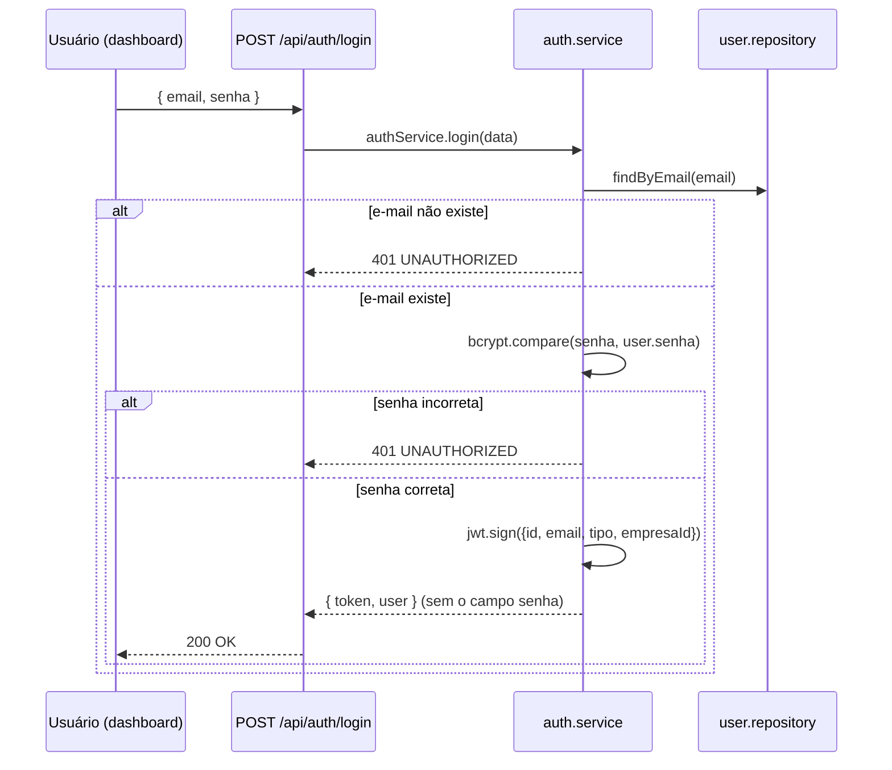
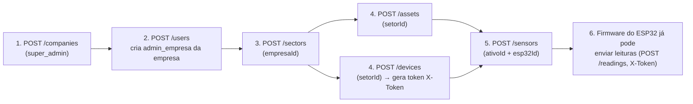
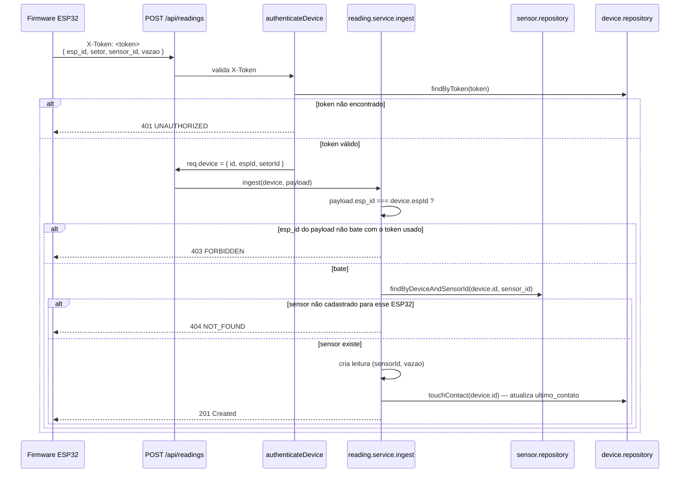
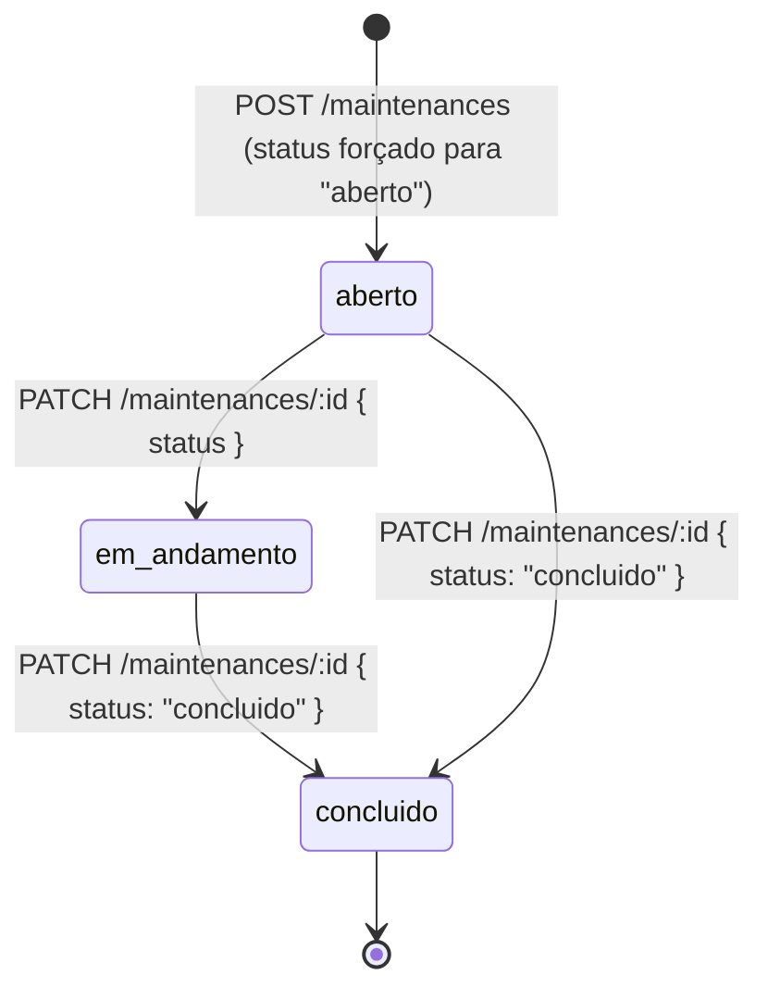
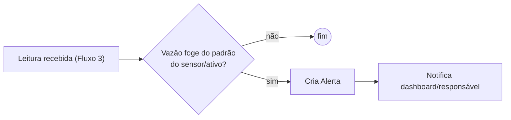

# Fluxos de Negócio e Regras de Negócio

## Fluxo 1 — Login do dashboard

A mensagem de erro é a mesma ("E-mail ou senha inválidos") tanto para e-mail inexistente quanto para senha errada — evita que o endpoint funcione como um oráculo de "esse e-mail está cadastrado?" (user enumeration). Ver [AUTHENTICATION.md](./AUTHENTICATION.md).

## Fluxo 2 — Provisionamento da hierarquia (cadastro inicial de uma empresa)

Ordem obrigatória, porque cada nível referencia o anterior:

Passo 5 tem uma regra que não é óbvia pelo desenho: **o `ativo` e o `esp32` informados precisam pertencer ao mesmo `setor`** (checado em [`sensor.service.ts`](../src/modules/sensors/services/sensor.service.ts) antes do `create` — lança `ValidationError` 422 se não pertencerem). Isso existe porque um sensor fisicamente conecta um equipamento a uma central de comunicação que está no mesmo ambiente; não faz sentido vincular um ativo do setor "Produção" a um ESP32 do setor "Limpeza".

## Fluxo 3 — Ingestão de leitura pelo ESP32

Este é o fluxo de maior volume do sistema — roda a cada envio do firmware (na prática, em intervalo curto, contínuo).

Duas camadas de defesa aqui, de propósito: o `X-Token` já identifica **qual** ESP32 está falando (não dá pra um dispositivo se passar por outro só mudando o `esp_id` no corpo), e o `sensor_id` só é aceito se pertencer **àquele mesmo** ESP32 (`findByDeviceAndSensorId`, que usa a constraint `UNIQUE(esp32_id, sensor_id)` do banco). O campo `setor` do payload (documentado no README, herdado do firmware já existente) é aceito mas não é usado para autorização — quem manda a leitura é o `esp_id` + o token, não o texto livre `setor`.

Efeito colateral do fluxo: `esp32.ultimo_contato` é atualizado a cada leitura aceita — é o mecanismo (simples) de saber se um dispositivo está online.

## Fluxo 4 — Ciclo de vida de um chamado de manutenção

Regra implementada em [`maintenance.repository.ts`](../src/modules/maintenances/repositories/maintenance.repository.ts): `concluido_em` é setado automaticamente pelo backend (não é um campo que o cliente envia) sempre que `status` muda para `"concluido"` — não existe transição "desfazer conclusão" nesta etapa.

## Fluxo 5 — Detecção de vazamento/consumo anômalo

🚧 **Não implementado nesta etapa.** O módulo `alerts` existe (rota, controller, service, entidade) mas todo `GET /api/alerts` responde `501 NOT_IMPLEMENTED` de propósito — ver [`alert.service.ts`](../src/modules/alerts/services/alert.service.ts). Está listado como próxima etapa no README raiz. Quando for implementado, o fluxo esperado é:

## Regras de negócio por entidade

### Empresa
- `nome` obrigatório (2–100 caracteres); `cnpj` opcional, mas único quando informado.
- Só `super_admin` pode criar, editar ou remover empresas.
- Usuários não-`super_admin` só enxergam a própria empresa em `GET /companies` (nunca a lista completa).

### Usuário
- `email` único no sistema inteiro (não só por empresa).
- `senha` nunca é armazenada em claro (bcrypt, 10 salt rounds) nem retornada em nenhuma resposta da API.
- `empresaId` é `NULL` **somente** para `tipo = super_admin`; para `admin_empresa`/`funcionario` é obrigatório.
- Só `super_admin` pode criar outro `super_admin`.
- `admin_empresa`/`super_admin` só conseguem criar usuário vinculado à **própria** empresa (ou qualquer uma, se `super_admin`) — `assertSameCompany` barra a tentativa de criar usuário em empresa alheia.
- Endpoint de exclusão (`DELETE /users/:id`) é restrito a `super_admin`.

### Setor
- Pertence a exatamente uma empresa (`empresaId` obrigatório e imutável após criação — não faz parte do payload de update).
- Criação/edição restrita a `super_admin` e `admin_empresa` da própria empresa.

### Ativo
- Pertence a exatamente um setor; `criticidade` default `'media'` quando não informada.
- `tag`, quando informada, é única no sistema inteiro (identificação física do equipamento).

### ESP32 (device)
- Pertence a exatamente um setor; `esp_id` único (identificador usado pelo firmware) e `token` único (credencial do header `X-Token`).
- O `token` só é retornado no corpo da resposta de **criação** — chamadas subsequentes (`list`/`getById`) nunca expõem o token de volta (ver [`toPublicDevice`](../src/modules/devices/entities/device.entity.ts)).

### Sensor
- Vincula um `ativo` a um `esp32`; ambos precisam já existir e **pertencer ao mesmo setor** (regra do Fluxo 2).
- `(esp32_id, sensor_id)` é único — o `sensor_id` do payload (ex.: `"sensor_01"`) só precisa ser único dentro do mesmo ESP32, não globalmente.

### Leitura
- Só é criada pelo fluxo de ingestão autenticado por `X-Token` (não existe endpoint para um usuário do dashboard criar uma leitura manualmente).
- `vazao` não aceita valores negativos (`min(0)` no validator).
- Leituras são imutáveis: não existem endpoints de `update`/`delete` para `leitura` — é um log de série temporal, não um registro editável.

### Manutenção
- Sempre nasce com `status = 'aberto'`, independente do que o cliente enviar.
- `concluido_em` é derivado (setado pelo backend quando `status` vira `'concluido'`), nunca informado diretamente pelo cliente.
- `funcionario_id` é opcional — um chamado pode existir sem responsável atribuído.
