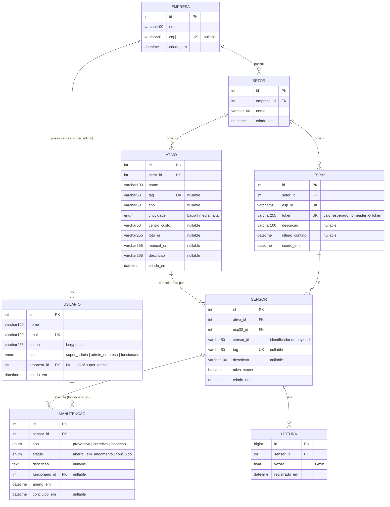

# Banco de Dados

Fonte da verdade: [`db/db.sql`](../db/db.sql) (DDL "de mão", pensado primeiro) e [`prisma/schema.prisma`](../prisma/schema.prisma) (espelho 1:1 usado pelo backend em runtime). **Os dois precisam ser alterados juntos** até o projeto migrar de vez para Prisma Migrate como única fonte de verdade — ver [ADR 0002](./adr/0002-mysql-prisma.md).

## Diagrama Entidade-Relacionamento



## Hierarquia e por que ela existe

```
Empresa (tenant)
 └─ Setor (produção, resfriamento, limpeza...)
     ├─ Ativo (tanque, bomba, tubulação — o equipamento físico monitorado)
     └─ ESP32 (a central de comunicação instalada naquele setor)
         └─ Sensor (liga um Ativo a um ESP32 — o YF-S201 que mede a vazão)
             ├─ Leitura (histórico de vazão enviado pelo sensor)
             └─ Manutenção (chamados abertos para aquele sensor)
```

Todo isolamento entre clientes (multi-tenant) deriva desta hierarquia: um recurso "pertence" a uma empresa por herança via `setor_id`/`ativo_id`/`esp32_id`/`sensor_id` até chegar em `setor.empresa_id`. Ver como isso é aplicado em código em [ARCHITECTURE.md](./ARCHITECTURE.md#multi-tenant-como-o-isolamento-entre-empresas-é-aplicado).

## Tabelas

### `empresa`

| Coluna | Tipo | Constraint |
| --- | --- | --- |
| `id` | `INT` | PK, auto-increment |
| `nome` | `VARCHAR(100)` | `NOT NULL` |
| `cnpj` | `VARCHAR(20)` | `UNIQUE`, nullable |
| `criado_em` | `DATETIME` | default `CURRENT_TIMESTAMP` |

### `usuario`

| Coluna | Tipo | Constraint |
| --- | --- | --- |
| `id` | `INT` | PK, auto-increment |
| `nome` | `VARCHAR(100)` | `NOT NULL` |
| `email` | `VARCHAR(100)` | `UNIQUE`, `NOT NULL` |
| `senha` | `VARCHAR(255)` | `NOT NULL` — hash bcrypt, nunca a senha em claro |
| `tipo` | `ENUM('super_admin','admin_empresa','funcionario')` | `NOT NULL` |
| `empresa_id` | `INT` | FK → `empresa.id`, `NULL` **apenas** para `super_admin` |
| `criado_em` | `DATETIME` | default `CURRENT_TIMESTAMP` |

### `setor`

| Coluna | Tipo | Constraint |
| --- | --- | --- |
| `id` | `INT` | PK, auto-increment |
| `empresa_id` | `INT` | FK → `empresa.id`, `NOT NULL` |
| `nome` | `VARCHAR(100)` | `NOT NULL` |
| `criado_em` | `DATETIME` | default `CURRENT_TIMESTAMP` |

### `ativo`

| Coluna | Tipo | Constraint |
| --- | --- | --- |
| `id` | `INT` | PK, auto-increment |
| `setor_id` | `INT` | FK → `setor.id`, `NOT NULL` |
| `nome` | `VARCHAR(100)` | `NOT NULL` |
| `tag` | `VARCHAR(50)` | `UNIQUE`, nullable — identificação física |
| `tipo` | `VARCHAR(50)` | nullable — ex.: `"tanque"`, `"bomba"`, `"válvula"` |
| `criticidade` | `ENUM('baixa','media','alta')` | `NOT NULL`, default `'media'` |
| `centro_custo` | `VARCHAR(50)` | nullable |
| `foto_url` / `manual_url` | `VARCHAR(255)` | nullable |
| `descricao` | `VARCHAR(255)` | nullable |
| `criado_em` | `DATETIME` | default `CURRENT_TIMESTAMP` |

Índice: `idx_ativo_criticidade` em `criticidade` (consulta por criticidade — ex.: dashboard de ativos críticos).

### `esp32`

| Coluna | Tipo | Constraint |
| --- | --- | --- |
| `id` | `INT` | PK, auto-increment |
| `setor_id` | `INT` | FK → `setor.id`, `NOT NULL` |
| `esp_id` | `VARCHAR(50)` | `UNIQUE`, `NOT NULL` — identificador usado no payload/firmware |
| `token` | `VARCHAR(255)` | `UNIQUE`, `NOT NULL` — valor esperado no header `X-Token` |
| `descricao` | `VARCHAR(100)` | nullable |
| `ultimo_contato` | `DATETIME` | nullable — atualizado a cada leitura recebida (heartbeat) |
| `criado_em` | `DATETIME` | default `CURRENT_TIMESTAMP` |

⚠️ `token` é `UNIQUE` (evita colisão entre dispositivos) mas fica em **texto plano** no banco — ver [SECURITY.md](./SECURITY.md#credenciais-de-dispositivo-x-token).

### `sensor`

| Coluna | Tipo | Constraint |
| --- | --- | --- |
| `id` | `INT` | PK, auto-increment |
| `ativo_id` | `INT` | FK → `ativo.id`, `NOT NULL` |
| `esp32_id` | `INT` | FK → `esp32.id`, `NOT NULL` |
| `sensor_id` | `VARCHAR(50)` | `NOT NULL` — identificador usado no payload (ex.: `"sensor_01"`) |
| `tag` | `VARCHAR(50)` | `UNIQUE`, nullable |
| `descricao` | `VARCHAR(100)` | nullable |
| `ativo_status` | `BOOLEAN` | default `TRUE` — sensor ligado/desligado |
| `criado_em` | `DATETIME` | default `CURRENT_TIMESTAMP` |

Constraint: `UNIQUE(esp32_id, sensor_id)` — o mesmo `sensor_id` do payload só é ambíguo entre ESP32s diferentes, nunca dentro do mesmo.

### `leitura`

| Coluna | Tipo | Constraint |
| --- | --- | --- |
| `id` | `BIGINT` | PK, auto-increment |
| `sensor_id` | `INT` | FK → `sensor.id`, `NOT NULL` |
| `vazao` | `FLOAT` | `NOT NULL` — L/min |
| `registrado_em` | `DATETIME` | default `CURRENT_TIMESTAMP` |

Índice: `idx_leitura_sensor_data` em `(sensor_id, registrado_em)` — cobre a consulta mais comum ("histórico de um sensor, mais recente primeiro").

`id` é `BIGINT` porque é a tabela de maior volume do sistema (uma linha por leitura enviada por cada sensor). No backend, o valor é serializado para `number` no JSON (ver [`src/utils/bigint-json.ts`](../src/utils/bigint-json.ts)).

### `manutencao`

| Coluna | Tipo | Constraint |
| --- | --- | --- |
| `id` | `INT` | PK, auto-increment |
| `sensor_id` | `INT` | FK → `sensor.id`, `NOT NULL` |
| `tipo` | `ENUM('preventiva','corretiva','inspecao')` | `NOT NULL` |
| `status` | `ENUM('aberto','em_andamento','concluido')` | default `'aberto'` |
| `descricao` | `TEXT` | nullable |
| `funcionario_id` | `INT` | FK → `usuario.id`, nullable |
| `aberto_em` | `DATETIME` | default `CURRENT_TIMESTAMP` |
| `concluido_em` | `DATETIME` | nullable — setado quando `status` vira `'concluido'` |

Índice: `idx_manutencao_status` em `status` (fila de chamados abertos/em andamento).

## O que ainda não existe

- **Tabela de `alerta`**: a detecção de vazamento/consumo anômalo é regra de negócio ainda não implementada (ver [BUSINESS_FLOWS.md](./BUSINESS_FLOWS.md#detecção-de-vazamentoconsumo-anômalo)); quando for, a tabela entra aqui.
- **Migrations versionadas do Prisma** (`prisma/migrations/`): o schema ainda não passou por `prisma migrate dev` neste repositório — `npm run prisma:migrate` vai criar a primeira migração a partir do estado atual de `schema.prisma`.
