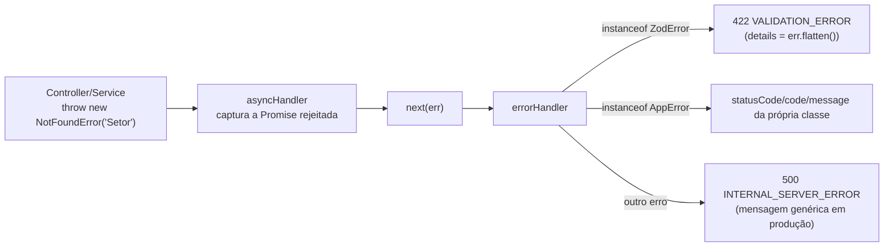

# Tratamento de Erros

## Formato

Todo erro — de validação, de negócio ou inesperado — vira uma resposta JSON no mesmo formato, produzida pelo [`error-handler.middleware.ts`](../src/middlewares/error-handler.middleware.ts) (o último middleware da cadeia, registrado em `app.ts`):

```json
{
  "success": false,
  "error": {
    "code": "NOT_FOUND",
    "message": "Setor não encontrado.",
    "details": { }
  }
}
```

`details` só aparece quando há informação estruturada extra (ex.: erro de validação do Zod); na maioria dos erros de negócio ele não existe.

## Como um erro chega até essa resposta



Controllers e services nunca chamam `res.status(...).json(...)` para erro — eles só dão `throw`. Isso é possível porque toda rota é envolvida por [`asyncHandler`](../src/utils/async-handler.ts), que captura a Promise rejeitada e chama `next(err)` automaticamente, entregando o erro ao `errorHandler`.

## Catálogo de códigos (`error.code`)

| `code` | HTTP status | Classe | Quando acontece |
| --- | --- | --- | --- |
| `VALIDATION_ERROR` | 422 | `ValidationError` / `ZodError` | Body/params/query fora do schema Zod, ou regra de negócio de formato (ex.: ativo e ESP32 de setores diferentes) |
| `UNAUTHORIZED` | 401 | `UnauthorizedError` | Token ausente, inválido, expirado; `X-Token` inválido; login com credencial errada |
| `FORBIDDEN` | 403 | `ForbiddenError` | Usuário autenticado, mas sem permissão para esse recurso/ação (papel errado ou empresa diferente) |
| `NOT_FOUND` | 404 | `NotFoundError` | Recurso com esse ID não existe |
| `CONFLICT` | 409 | `ConflictError` | Reservado para conflito de estado (ex.: unicidade) — hoje a maioria das violações de `UNIQUE` do banco ainda não é traduzida para este código, ver nota abaixo |
| `NOT_IMPLEMENTED` | 501 | `NotImplementedError` | Funcionalidade prevista mas não construída nesta etapa (hoje: `GET /api/alerts`) |
| `ROUTE_NOT_FOUND` | 404 | — (`not-found.middleware.ts`) | Método/caminho que não bate com nenhuma rota registrada |
| `INTERNAL_SERVER_ERROR` | 500 | — (fallback do `errorHandler`) | Qualquer erro não tratado explicitamente |

Todas as classes de erro de negócio estão em [`src/shared/errors/app-error.ts`](../src/shared/errors/app-error.ts), como subclasses de `AppError`.

## Nota sobre `CONFLICT` (409) — gap conhecido

A classe `ConflictError` existe, mas **nenhum repository a usa hoje**. Uma violação de `UNIQUE` do MySQL (ex.: tentar criar uma empresa com um CNPJ que já existe) lança uma exceção do Prisma que os métodos `update`/`remove` engolem (viram `404`) e o método `create` **não engole** — nesse caso ela sobe crua até o `errorHandler`, cai no branch genérico e vira `500 INTERNAL_SERVER_ERROR`, quando deveria ser um `409 CONFLICT` claro para o cliente. Ver mais contexto em [SECURITY.md](./SECURITY.md#tratamento-de-erro-e-vazamento-de-informação); a correção é mapear os códigos de erro do Prisma (`P2002` = unique constraint) para `ConflictError` no ponto onde cada repository chama `create`.

## O que o frontend deve fazer com cada status

| Status | Ação recomendada no cliente |
| --- | --- |
| `401` | Descartar o token guardado e mandar o usuário para o login |
| `403` | Mostrar "sem permissão" — não é um caso para tentar de novo |
| `404` | Tratar como "não existe" (ex.: esconder o item, ou 404 de página) |
| `422` | Mostrar os erros de campo (usar `error.details` quando presente) perto do formulário |
| `409` | Mostrar mensagem de conflito e sugerir outro valor (ex.: "CNPJ já cadastrado") |
| `500` / `501` | Erro genérico — não é algo que o usuário pode corrigir preenchendo diferente |

## Exemplo real — erro de validação do Zod

```http
POST /api/auth/login
Content-Type: application/json

{ "email": "nao-e-email" }
```

```json
422 Unprocessable Entity
{
  "success": false,
  "error": {
    "code": "VALIDATION_ERROR",
    "message": "Dados inválidos.",
    "details": {
      "formErrors": [],
      "fieldErrors": {
        "email": ["Invalid email"],
        "senha": ["Required"]
      }
    }
  }
}
```
